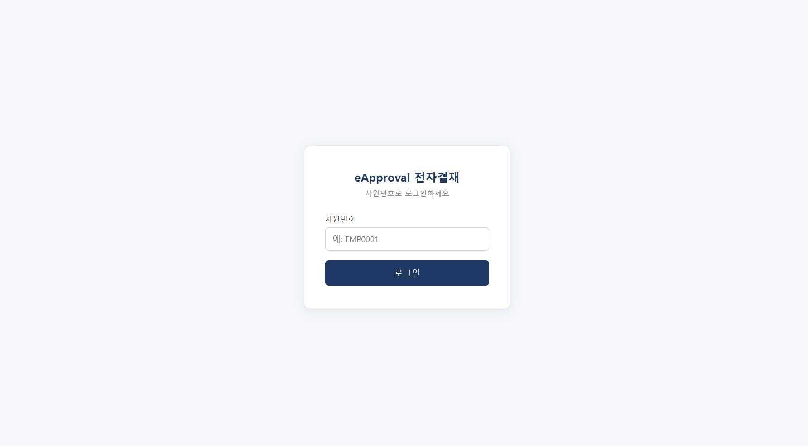
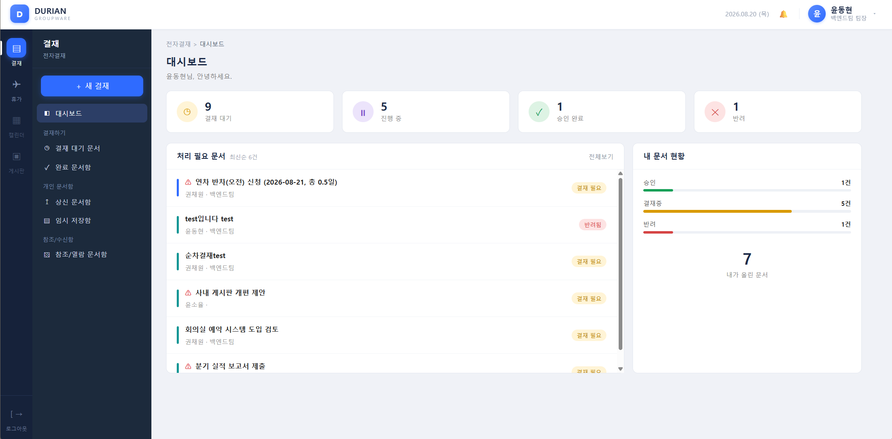
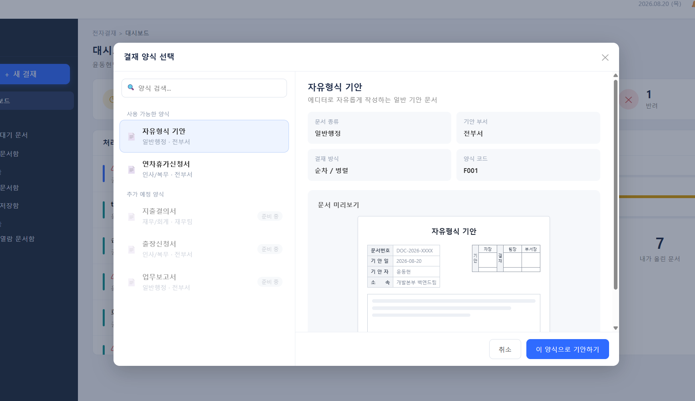
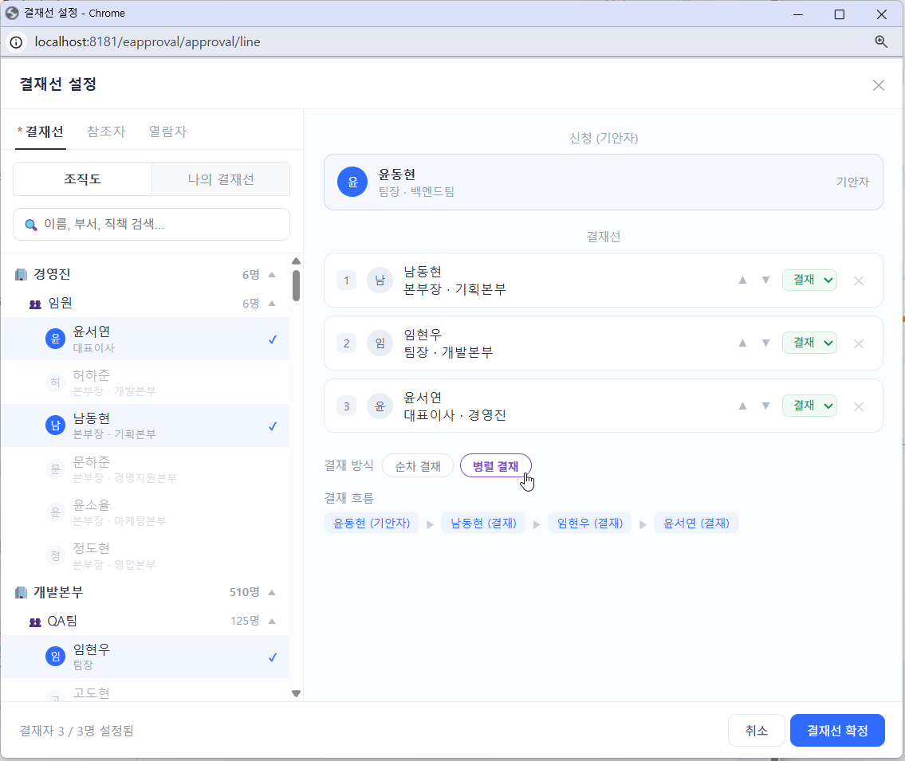
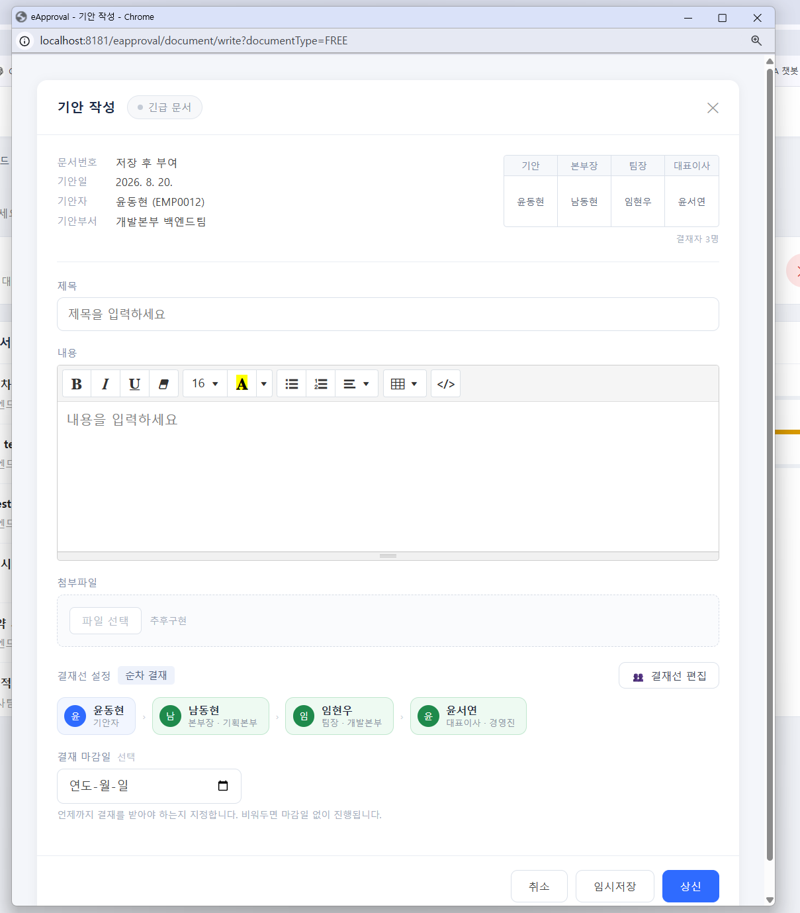
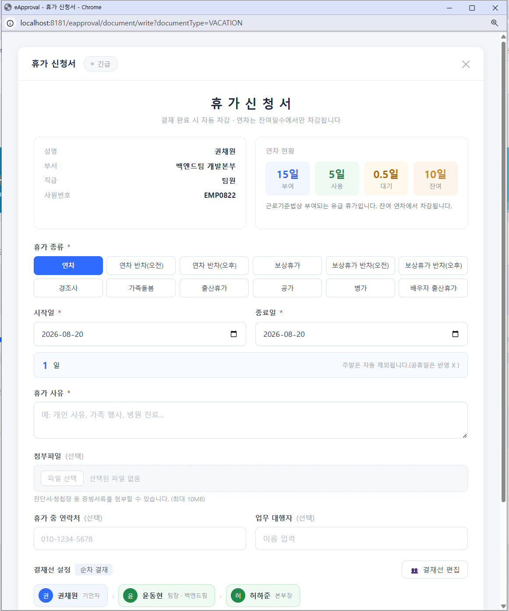
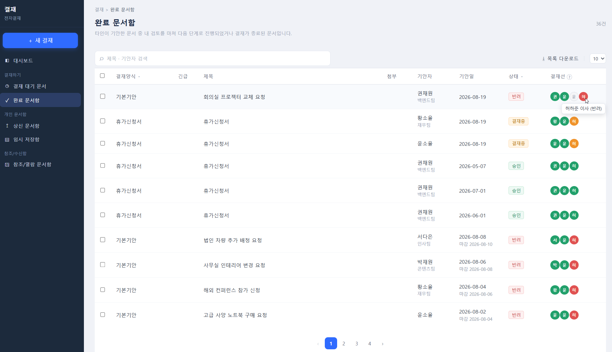
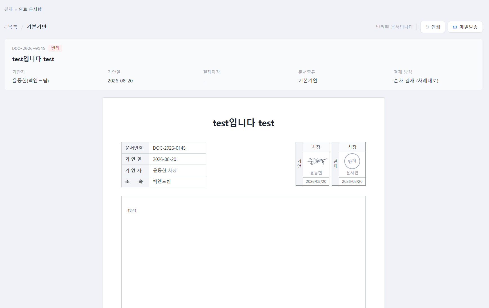
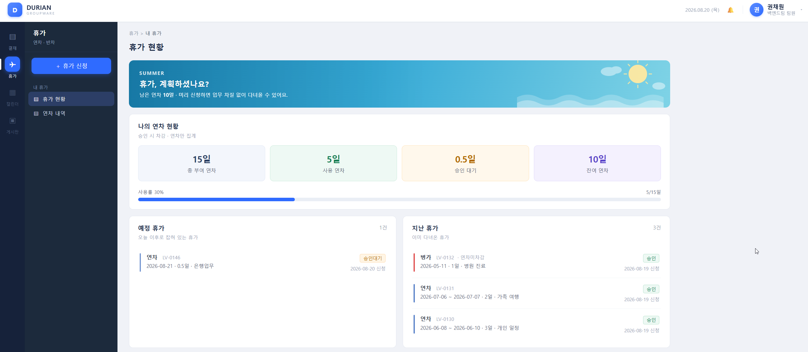
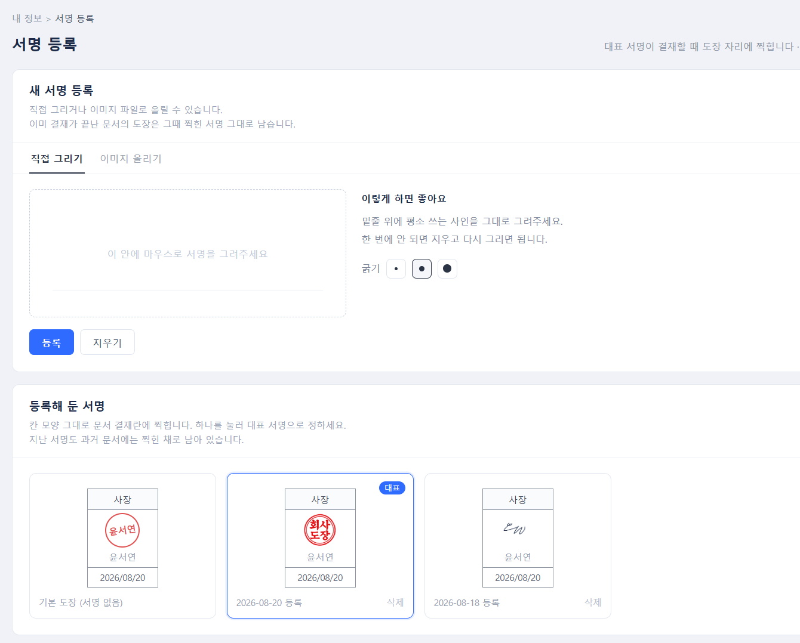

# eapproval — 사내 전자결재 · 휴가관리 시스템

기안부터 결재 · 반려 · 재상신까지, 종이 결재의 흐름을 그대로 옮긴 웹 전자결재 시스템입니다.

- 개발 기간 : 2026-07-18 ~ 2026-08-20 (약 5주)
- 형태 : **기업 연계 개인 프로젝트** (1인 개발)
- 커밋 : 120건
- **본 문서는 1차 구현 기준입니다.** 핵심 결재 흐름과 휴가 관리를 우선 완성했고,
  이후 계획은 8장에 정리했습니다.

---

## 1. 프로젝트 개요

두리안정보기술 기업 연계 과제로 진행한 개인 프로젝트입니다.
연계 기업의 요구사항은 **"학습한 기술 범위 안에서 직접 구현할 것"** 이었습니다.
그래서 Spring Boot 대신, 학습한 **Maven 기반 Spring MVC (XML 설정)** 로 구성했습니다.

`web.xml` 에 DispatcherServlet 을 등록하고, `servlet-context.xml` 에 ViewResolver 와 Interceptor 를,
`datasource.xml` 에 SqlSessionFactory 와 트랜잭션 매니저를 직접 올렸습니다.
자동 설정에 기대지 않고 요청이 어디를 거쳐 어디로 가는지 직접 확인하며 만들었습니다.

### 역할 분담

| 영역 | 담당 |
|------|------|
| 요구사항 정리 · 데이터 모델 설계 | 직접 |
| 서버 (Controller · Service · Mapper · 트랜잭션 · 검증) | 직접 |
| DB 스키마 · SQL | 직접 |
| 화면 (JSP 마크업 · CSS · jQuery) | **화면 구성과 동작 방식을 직접 설계하고, 구현은 AI 를 활용** |

화면 코드는 AI 로 작성했지만, **어떤 값을 서버로 보낼지와 무엇을 화면에서 판단할지는
직접 정하고 검토했습니다.** 5장 ①·② 는 그 과정에서 나온 판단입니다.

---

## 2. 기술 스택

| 구분 | 사용 기술 |
|------|-----------|
| Language | Java 11 |
| Framework | Spring Framework 5.3.6 (Spring MVC, XML 설정) |
| Persistence | MyBatis 3.5.19 / mybatis-spring 2.1.2 |
| Database | MySQL 8 |
| View | JSP + JSTL 1.2, jQuery |
| Build | Maven (packaging: war) |
| WAS | Apache Tomcat 9 |
| 도구 | Eclipse, Git |

---

## 3. 화면

| 로그인 | 대시보드 |
|--------|----------|
|  |  |

| 결재 양식 선택 | 결재선 설정 |
|----------------|-------------|
|  |  |

| 기안 작성 | 휴가 신청서 |
|-----------|-------------|
|  |  |

| 완료 문서함 | 문서 상세 (결재 도장) |
|-------------|----------------------|
|  |  |

| 휴가 현황 | 전자서명 등록 |
|-----------|---------------|
|  |  |

---

## 4. 주요 기능

### 결재

| 기능 | 설명 |
|------|------|
| 기안 작성 | 기본기안(자유형식) / 휴가신청서. 임시저장 후 이어쓰기 |
| 결재선 지정 | 조직도에서 결재자 선택. 순차 · 병렬 방식 선택, 최대 3명 |
| 상신 · 상신취소 | 결재가 한 건이라도 진행되면 취소 불가 |
| 승인 · 반려 | 결재 의견과 전자서명 이미지를 함께 기록 |
| 재상신 | 반려 문서를 고쳐 다시 상신. 지난 결재 이력은 차수로 보존 |
| 결재 마감일 | 남은 날짜에 따라 색이 바뀌고, 결재가 끝나면 색 없이 날짜만 표시 |
| 문서 인쇄 | 화면의 종이를 A4 규격으로 고정해 인쇄 결과와 크기를 일치 |
| 문서함 | 임시저장 · 상신 · 결재 대기 · 완료 문서함. 페이징 · 검색 · 종류 필터 |
| 전자서명 | 마우스로 직접 그리거나 이미지 업로드. 여러 개 등록 후 대표 서명 지정 |

기존 문서에 이미 찍힌 도장은 **그때 사용한 서명 그대로 남습니다.**
대표 서명을 바꿔도 과거 문서의 결재란이 함께 바뀌지 않도록,
결재 시점의 서명 ID 를 `approval_line` 에 기록합니다.

### 휴가

| 기능 | 설명 |
|------|------|
| 휴가 신청 | 연차 · 반차 · 보상휴가 · 경조사 · 가족돌봄 · 출산 · 공가 · 병가 등 |
| 일수 자동 계산 | 시작일 ~ 종료일에서 토 · 일 제외. 반차는 0.5일 |
| 연차 차감 | 결재 완료 시 잔여 연차에서 자동 차감. **연차 차감 대상 휴가만** |
| 잔여 검증 | 이미 상신해 대기 중인 휴가까지 빼고 계산해 초과 신청을 차단 |
| 중복 신청 차단 | 같은 기간에 대기 · 승인 상태인 휴가가 있으면 상신 불가 |
| 내 휴가 현황 | 총부여 / 사용 / 대기 / 잔여, 예정 · 지난 휴가 목록 |

휴가 종류는 코드가 아니라 **DB(`vacation_type`) 에서 관리**합니다.
종류 이름 · 안내 문구 · 한도 · 연차 차감 여부 · 반차 허용 여부가 모두 컬럼이라,
종류가 늘어나도 Java 코드를 고칠 일이 없습니다.

### 공통

- 세션 기반 인증 (`LoginCheckInterceptor`)
- **관리자 권한** — 인사팀 · 임원에게 부여. `AdminCheckInterceptor` 가 `role = 'ADMIN'` 을 확인
- 대시보드 — 결재 대기 · 진행 중 · 승인 · 반려 건수와 내 문서 현황
- 목록 페이징 · 검색 · 종류 필터를 `PageVO` 하나로 처리

---

## 5. 설계에서 신경 쓴 점

### ① 사용자가 정하면 안 되는 값은 화면에서 받지 않는다

기안 작성 화면이 서버로 보내는 결재선 정보는 `approverId` 하나뿐입니다.
결재 순서 · 결재 상태 · 차수는 전부 서버가 채웁니다.

```java
// DocumentService.saveApprovalLines()
line.setApprovalOrder(i + 1);
line.setRound(round);
line.setApprovalStatus("PENDING");
```

hidden 값은 개발자도구로 얼마든지 바꿀 수 있기 때문입니다.
같은 이유로 기안자 사원번호도 폼이 아니라 세션에서 꺼내 덮어씁니다.

### ② 화면 검증과 서버 검증을 모두 둔다

결재자 3명 제한은 화면에서 막고, 서버에서도 다시 검사합니다.
화면 검사는 4번째를 누른 순간 알려주기 위한 **편의**이고, 실제 방어선은 서버입니다.
브라우저 콘솔에서 hidden 을 하나 더 심어 4명을 전송해 보고, 서버가 막는 것을 확인했습니다.

### ③ 같은 질문의 답은 한 곳에만 둔다

휴가 목록에 '연차 미차감' 을 표시할 때, 화면에서 `종류 이름이 '연차'가 아니면` 으로 판단하지 않고
실제 차감 로직이 보는 것과 같은 **연차 차감 여부 컬럼**(`vacation_type.deduct_balance`)을 봅니다.
화면과 로직이 서로 다른 기준을 쓰면, 휴가 종류가 하나 늘어나는 순간 어긋나기 때문입니다.

### ④ 이력은 지우지 않고 쌓는다

임시저장은 여러 번 누를 수 있어, 결재선을 통째로 지우고 다시 넣는 방식을 씁니다.
그런데 반려 후 재상신에도 같은 방식을 쓰면 **1차 결재에서 누가 반려했는지가 사라집니다.**

그래서 `approval_line.round`(차수)를 두고, 이미 처리된 결재가 있으면 차수를 올려 새로 쌓습니다.
조회는 항상 최신 차수만 보므로 화면은 그대로이고, 과거 기록은 DB 에 남습니다.

```java
private int writableRound(Long docId) {
    Integer max = documentMapper.selectMaxRound(docId);
    if (max == null) return 1;               // 결재선을 처음 넣는 문서
    return documentMapper.countDoneLines(docId, max) > 0 ? max + 1 : max;
}
```

### ⑤ DB 제약으로 못 막는 규칙은 Service 에 둔다

임시저장은 내용이 비어 있어도 저장돼야 하므로 컬럼 제약을 느슨하게 잡을 수밖에 없습니다.
같은 테이블인데 문서 상태에 따라 기준이 달라지는 셈입니다.
그래서 상신에만 적용되는 규칙(결재선 유무, 결재자 수, 휴가 사유 · 기간 · 잔여 연차)은
전부 `DocumentService.submitDocument()` 한곳에 모았습니다.

### ⑥ 검증 순서가 결과를 바꾸는 지점을 찾아 고쳤다

휴가 잔여 연차 검증을 문서 상태를 `PENDING` 으로 바꾼 **뒤에** 수행하면,
방금 상신한 자기 문서가 '대기 중인 연차' 로 함께 집계되어 스스로 잔여를 깎아버립니다.
재상신 때 연차가 모자란다고 나오던 문제의 원인이었고, 검증을 상태 변경 앞으로 옮겨 해결했습니다.

---

## 6. 데이터베이스

| 테이블 | 설명 |
|--------|------|
| `employee` | 사원. 잔여 연차 · 권한(`role`) 포함 |
| `department` / `team` | 조직도 |
| `document` | 문서 한 건. 제목 · 내용 · 상태 · 결재 방식 · 마감일 |
| `approval_line` | 결재선 한 줄. 결재자 · 순서 · 차수 · 결재 상태 · 의견 · 서명 |
| `vacation_request` | 휴가 문서에 딸리는 신청 정보 (기간 · 일수 · 반차) |
| `vacation_type` | 휴가 종류. 안내 문구 · 한도 · 연차 차감 여부 · 반차 허용 여부 |
| `signature` | 전자서명 이미지 |

### 문서 상태 흐름

```
  DRAFT ───── 상신 ─────> PENDING ───── 전원 승인 ─────> APPROVED
    ^                        │
    │                        │
    └───── 상신취소 ─────────┤
                             │
                             └───── 반려 ─────> REJECTED
                                                    │
                                                    └── 재상신 (차수 +1) ──> PENDING
```

상신취소는 결재가 한 건도 진행되지 않았을 때만 가능합니다.
재상신은 문서를 `REJECTED` 인 채로 두고 검증만 수행한 뒤,
새 차수의 결재선을 쌓으면서 `PENDING` 으로 바꿉니다. 반려 기록을 남기기 위해서입니다.

---

## 7. 실행 방법

**요구 사항** : JDK 11, Maven, MySQL 8, Apache Tomcat 9

### 1) 저장소 받기

```bash
git clone <저장소 주소>
cd eapproval
```

### 2) 데이터베이스 준비

```sql
CREATE DATABASE eapproval_Backend
  DEFAULT CHARACTER SET utf8mb4
  COLLATE utf8mb4_general_ci;
```

스키마와 초기 데이터는 `docs/schema.sql` 로 함께 제공합니다.

### 3) 접속 정보 수정

`src/main/resources/config/datasource.properties`

```properties
db.driverClass=com.mysql.cj.jdbc.Driver
db.url=jdbc:mysql://localhost:3306/eapproval_Backend?serverTimezone=Asia/Seoul&characterEncoding=UTF-8
db.username=<본인 계정>
db.password=<본인 비밀번호>
```

### 4) 빌드 후 Tomcat 배포

```bash
mvn clean package
```

생성된 war 를 Tomcat 에 배포한 뒤 `http://localhost:8080/eapproval` 로 접속합니다.

### 5) 로그인

로그인은 **사번(`employee_code`)** 으로 합니다. 예 : `EMP0012`

이번 범위에서 인증은 검증 대상이 아니라고 판단해 **비밀번호 절차를 의도적으로 두지 않았습니다.**
결재 흐름 · 트랜잭션 · 데이터 정합성에 집중하기 위한 선택이며,
비밀번호 인증은 8장의 다음 단계에 포함되어 있습니다.

---

## 8. 다음 단계 (2차 구현 예정)

1차 구현에서는 결재 흐름과 휴가 관리를 완성하는 데 집중했습니다.
아래는 다음 단계로 계획한 항목들입니다.

| 항목 | 계획 |
|------|------|
| 합의 · 참조 · 열람 | 화면에는 이미 자리를 만들어 두었고, 서버 저장과 조회를 이어붙일 예정 |
| 대표이사 결재선 | 대표이사는 **승인을 받을 대상이 아니라 합의 · 열람 대상**으로 두는 것이 맞다고 판단해, 위 항목과 함께 구현 예정 |
| 비밀번호 인증 | 비밀번호 컬럼과 해시 검증 추가 |
| 파일 첨부 | 기안 · 휴가 증빙서류 업로드 |
| 문서 목록 다운로드 | Excel / CSV 내보내기 |
| 공휴일 반영 | 공휴일 테이블을 만들어 휴가 일수 계산에 포함 (현재는 토 · 일만 제외) |
| 연차 외 휴가 집계 | 현재는 한도만 안내. 종류별 사용량 집계를 추가할지 검토 |

---

## 9. 폴더 구조

```
src/main/java/com/eapproval/
├── approval/                결재 · 휴가
│   ├── controller/          DocumentController, ApprovalLineController, LeaveController
│   ├── service/             DocumentService        ← 업무 규칙은 전부 여기
│   ├── dao/                 DocumentMapper
│   └── vo/                  DocumentVO, ApprovalLineVO, VacationRequestVO, VacationTypeVO ...
├── employee/                로그인 · 사원 · 전자서명
│   ├── controller/          LoginController, EmployeeController, SignatureController
│   ├── service/             LoginService, EmployeeService, SignatureService
│   ├── dao/                 EmployeeMapper, SignatureMapper
│   └── vo/                  EapprovalVO, OrgVO, SignatureVO
├── home/                    DashboardController
└── common/
    ├── interceptor/         LoginCheckInterceptor, AdminCheckInterceptor
    └── vo/                  PageVO

src/main/resources/
├── config/                  SqlMapConfig.xml, datasource.properties
├── mappers/                 approval/document.xml, employee/employee.xml, employee/signature.xml
└── spring/                  datasource.xml

src/main/webapp/WEB-INF/
├── web.xml
├── spring/                  servlet-context.xml
└── views/
    ├── approval/            documentForm, vacationForm, approvalLineForm, documentDetail,
    │                        draftList, submittedList, pendingList, completedList ...
    ├── employee/            login, employeeSearch, signatureForm
    ├── leave/               leaveMy
    ├── home/                dashboard
    └── common/              header, sidebar
```

---

## 10. Git 커밋 규칙

| 접두어 | 언제 | 예시 |
|--------|------|------|
| `feat` | 기능이 새로 생겼을 때 | `feat: 기안 임시저장 DocumentService 추가` |
| `fix` | 버그를 고쳤을 때 | `fix: 긴급 여부 미체크 시 null 저장되는 문제 수정` |
| `docs` | 주석 · 문서만 손댔을 때 | `docs: README 프로젝트 소개 추가` |
| `style` | 화면 CSS, 들여쓰기 등 동작 안 바뀜 | `style: 대시보드 사이드바 컬러 변경` |
| `test` | 테스트 코드를 새로 만들 때 | `test: DocumentMapper INSERT 테스트 추가` |
| `chore` | 설정 파일, 라이브러리 등 | `chore: 트랜잭션 매니저 설정 추가` |
